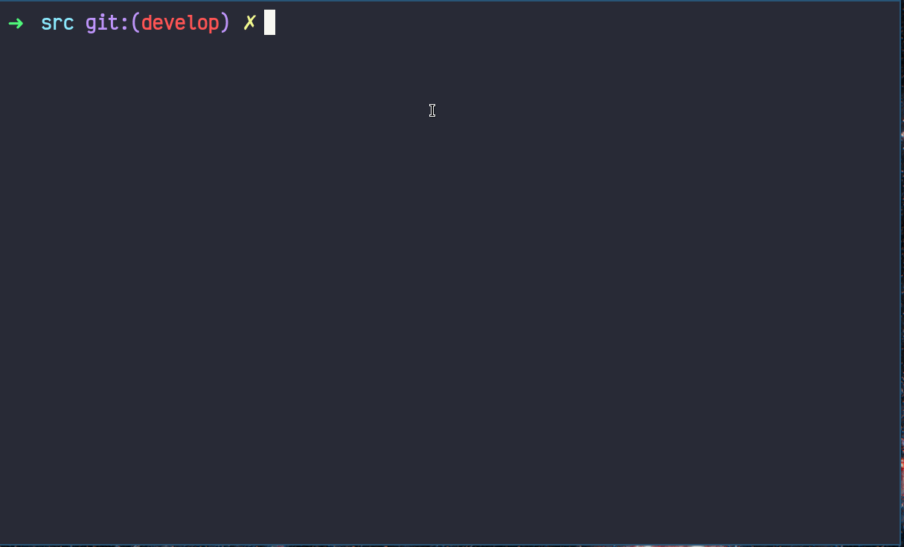

# String Processing Library

## Table of contents
* [Introduction](#Introduction)
* [Goals](#goals)
* [Build](#build)
* [Tests](#tests)
* [Credits](#credits)

## General info 
Implementation of libc `string.h` functions with some additions, including `sscanf` and `ssprintf` with all specifiers and flags. Fully covered with unit-tests under TDD approach. 

## Goals
- Become familiar with string handling in C
- Learning to work with functions with variable number arguments (stdarg.h)
- Following structured programming principles
- Unit test coverage & test driven development
- Teamwork & Communications (Trello)

## Build
```
$ git clone https://github.com/bezlant/s21_strings
$ cd s21_strings/src/
$ make 
```
### Tests
* Unit tests are implemented using [Check](https://libcheck.github.io/check/) & coverage report with [LCOV](https://github.com/linux-test-project/lcov)


## Credits
- Developers: [Mikhail Kuznetsov (@posidoni)](https://github.com/MikhailKuzntsov1), [Andrey Jhelannikov(@capricey)](https://github.com/AndreyZhelannikov), [Stepan Fedorov (@nanadaug)](https://github.com/co-cy), [Anton Bezludniy(@tarticar)](https://github.com/bezlant).
- Our team's lecture on this project is available on [Youtube (in Russian)](https://www.youtube.com/watch?v=ks3Banj3j7g). Any feedback & bug-reports are highly appreciated! 
